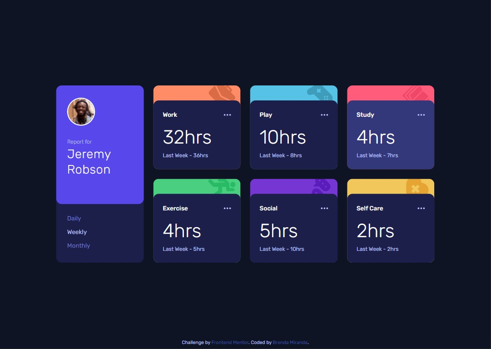

# Frontend Mentor - Time tracking dashboard solution

This is a solution to the [Time tracking dashboard challenge on Frontend Mentor](https://www.frontendmentor.io/challenges/time-tracking-dashboard-UIQ7167Jw). Frontend Mentor challenges help you improve your coding skills by building realistic projects. 

## Table of contents

- [Overview](#overview)
  - [The challenge](#the-challenge)
  - [Screenshot](#screenshot)
  - [Links](#links)
- [My process](#my-process)
  - [Built with](#built-with)
  - [What I learned and thoughts](#what-i-learned-and-thoughts)
  - [Useful resources](#useful-resources)
- [Author](#author)

## Overview

### The challenge

Users should be able to:

- View the optimal layout for the site depending on their device's screen size
- See hover states for all interactive elements on the page
- Switch between viewing Daily, Weekly, and Monthly stats

### Screenshot



### Links

- Solution URL: [https://github.com/bmirandach/time-tracking-dashboard](https://github.com/bmirandach/time-tracking-dashboard)
- Live Site URL: [https://time-tracking-dashboard-alpha.vercel.app/](https://time-tracking-dashboard-alpha.vercel.app/)

## My process

### Built with

- Semantic HTML5 markup
- CSS custom properties
- Flexbox
- CSS Grid
- Mobile-first workflow
- [Tailwind CSS](https://tailwindcss.com/) - CSS framework
- Javascript
- Fetch API
- [PostCSS](https://postcss.org/)

### What I learned and thoughts

First time working with the Fetch API, managing the data from a json file & using tailwindcss. It took me some time to figure out how to test the retrieval of the json file locally (it was with the live server extension for vs code) but after that everything went as smoothly as it could go. I needed help to configure tailwind somehow I can't do these things without watching a video 🤔 
I went and made a function to edit the innerHTML of some elements to have the values given by the json file. I thought about better ways to go about this, something like creating the elements inside the function but that idea was short lived. I'm still not confident with my javascript knowledge and manipulating the DOM like that was too much.

Tailwind helps a lot with the mobile-first workflow and with its way to apply the breakpoints I did the responsive design faster. I love the pre-existing classes and as they say 'You aren’t wasting energy inventing class names'. The fact that it has the dark mode variant & screen-reader-only class makes me want to practice more with this. Because there were many classes in the html I had to create my own classes to include the tailwind ones, this made the elements end up having only one class... easier to follow when I look back at my code sometime in the future.

Now, for the three dots... its was a tricky thing to do but I managed to do the hover effect with the help of javascript. The thing was to set the color of the card back to it's original when you hover the dots (while these get its own hover effect).

So I created a class called background that set the background color to the original color the card had, and that class was added or deleted depending of which was the event fired for the element (I made the three dots a button):

```html
<div class="container">
  <h1>Some title</h1>
  <button class="button">hover me</button>
</div>
```
```css
container.background {
  background-color: red;
}
```
```js
const button = document.querySelector('.button');

const addStyle = (e) => {
  e.target.closest('.container').classList.add('background');
};

const delStyle = (e) => {
  e.target.closest('.container').classList.remove('background');
};

button.addEventListener('mouseover', addStyle);
button.addEventListener('mouseout', delStyle);
```

### Useful resources

- [Using Async/Await with the Fetch API - JavaScript Tutorial](https://www.youtube.com/watch?v=Yp9KIcSKTNo) - The person explaining is so clear, videos like this help me to settle the idea
- [Guide to display JSON data in HTML using js](https://howtocreateapps.com/fetch-and-display-json-html-javascript/) - THIS, after I got to fetch the json this guide taught me how to disply the data, it might not be the best way but as it says 'it got the job done' and in a way I could understand, very helpful for a first time working with json files 👌

## Author

- Frontend Mentor - [@bmirandach](https://www.frontendmentor.io/profile/bmirandach)